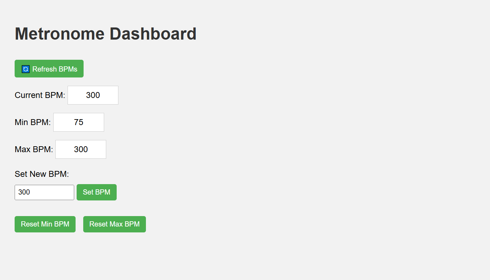

# 🎵 The Metronome Thing

A tempo-learning metronome built on Raspberry Pi, featuring a hardware interface (LEDs + buttons), a RESTful API, and a web-based dashboard — all running on a private local network.

> 🧑‍🎓 Created as part of the course *Programming the Internet of Things M*  
> 🎓 **Second cycle degree programme (LM)** in **Computer Engineering** (cod. 5826)  
> 🌍 During my **Erasmus exchange** at the **University of Bologna**, 2025

---

## 🧠 Features

- **Learn Mode**: Tap a button to teach the metronome your desired tempo (BPM)
- **Play Mode**: LED blinks at the recorded tempo
- **REST API**: Control the metronome programmatically (GET/PUT/DELETE)
- **Web Dashboard**: Simple HTML/JavaScript interface for interaction
- **Private Network**: Fully self-contained using a GL.iNet router, no internet required

---

## 🧰 Hardware Components

- 1 × Raspberry Pi (4B or compatible)
- 2 × Pushbuttons (Red and Green)
- 2 × LEDs (Red and Green)
- Resistors (330–470Ω for LEDs, 10kΩ pull-down for buttons)
- 1 × Breadboard
- Jumper wires (male-to-male and female-to-male)
- 1 × GL.iNet router (e.g. GL-MT300N-V2)

---

## 🔧 Software Overview

### Languages / Tools
- C++14
- cpprestsdk (REST API)
- wiringPi (GPIO)
- HTML/CSS/JavaScript
- Python HTTP server (for serving dashboard)

---

## 🛠️ Setup Instructions

### 1. Wiring
Connect the components to the Raspberry Pi GPIO as follows:

| Component                     | GPIO Pin |
|------------------------------|----------|
| Green LED                    | 21       |
| Red LED                      | 26       |
| Green Button (Mode Switch)   | 20       |
| Red Button (Tap Input)       | 16       |

Use current-limiting resistors for LEDs and pull-down resistors for the buttons.

---

### 2. Build the Project

```bash
sudo apt update
sudo apt install cmake g++ libcpprest-dev libssl-dev wiringpi libboost-all-dev

git clone https://github.com/Selms4/IOT_Metronome.git
cd .../part1

mkdir build && cd build
cmake ..
make
./main
```

---

### 3. Serve the Dashboard

In a separate terminal:

```bash
cd ../part2
python3 -m http.server 8000
```

Then open in a browser:

```
http://<raspberry-pi-ip>:8000/
```

> Example: `http://192.168.8.100:8000/`

---

## 🌐 REST API Endpoints

| Method | Endpoint         | Description                      |
|--------|------------------|----------------------------------|
| GET    | `/bpm/`          | Get current BPM                  |
| PUT    | `/bpm/`          | Set new BPM                      |
| GET    | `/bpm/min/`      | Get lowest BPM ever set          |
| DELETE | `/bpm/min/`      | Reset minimum BPM                |
| GET    | `/bpm/max/`      | Get highest BPM ever set         |
| DELETE | `/bpm/max/`      | Reset maximum BPM                |

Example usage with `curl`:

```bash
curl -X PUT http://<raspberry-pi-ip>:8080/bpm/ -H "Content-Type: application/json" -d 120
```

---

## 🧪 Usage Guide

### Learn Mode
1. Press **Green Button** to enter Learn Mode.
2. Tap **Red Button** rhythmically (at least 4 times).
3. Press **Green Button** again to switch to Play Mode.
4. The Green LED blinks at your set tempo.

### Web Dashboard
- View and set BPM
- Reset min/max values
- Control the metronome remotely

---

## 🔐 Network Architecture

This project runs inside a **private local network** using a **GL.iNet router in Router Mode**. No internet access is required. The Raspberry Pi and laptop are assigned local IPs (e.g., `192.168.8.x`) and communicate via HTTP.

---





## 👤 Author

Selma Memic 
Erasmus Student at University of Bologna  
Second cycle degree programme (LM) in Computer Engineering (cod. 5826)  
Course: *Programming the Internet of Things M*  
Instructor: Prof. Sumi Helal

---

## 📄 License

MIT License – use, modify, share freely. Credit appreciated.
